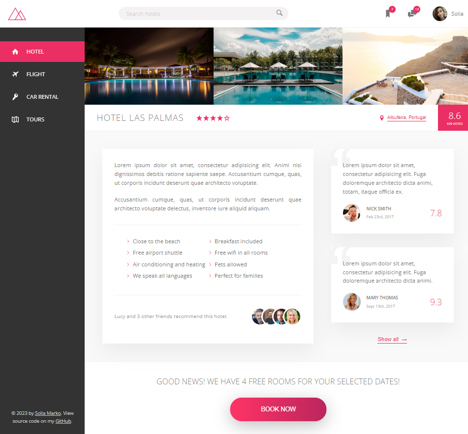

# [Trillo Hotel Booking - Responsive Layout](https://soliamarko.github.io/trillo-app/ "Trillo Hotel Booking - Responsive Layout")

`Live:` https://soliamarko.github.io/trillo-app/

A mockup hotel booking site. Completed with HTML & CSS (SASS).

Main Skill - **Flexbox**.

## Features

- Fully **responsive**
- **HTML** and **SASS** (+ a bit of **JS** for modals)
- **7-1 SASS pattern** & **BEM**
- **SVG sprites**

### Overview

---

Designed by Jonas Schmedtmann, implemented by me.



#### 1. Responsiveness:

---

The website is fully responsive thanks to `flexbox`.


#### 2. Nav Items Animations:

---

This is achieved by placing a `::before` pseudo element right on top of the button anchor text. This pseudo element is initially at the far left, when hovered, it expands and fills it's parent's full width.

<p align="center" width="100%">
     
</p>

#### 3. Hover Menue:

---

Hover menue is created with a `div` that is positioned `absolute`, and appears when hovered.

<p align="center" width="100%">
     
</p>

#### 4. Modal Images:

---


**Implementation:**

```
function openModal(e) {
  if (e.target.tagName !== "IMG") return;
  modal.style.display = "flex";
  modalImg.src = e.target.src;
}

function closeModal() {
  modal.style.display = "none";
}

gallery.addEventListener("click", openModal);

closeBtn.addEventListener("click", closeModal);
```

## How To . . .

- **change color of svg**, set directly in CSS as **background-image**?

```
background-color: yellow;
-webkit-mask-image: url(path);
-webkit-mask-size: cover;
```

## Used Tools

- _[Google Fonts](https://fonts.google.com/)_
- _[icomoon.io](https://icomoon.io/)_
